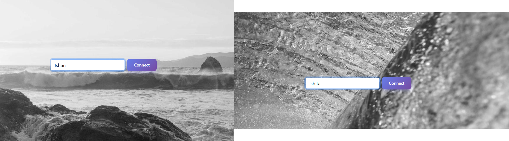
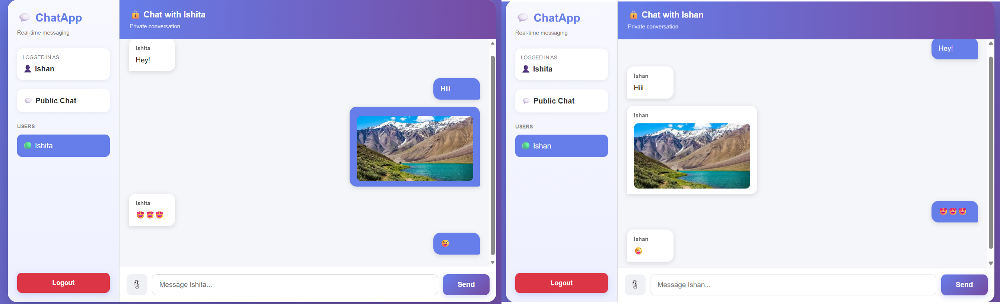

# 💬 Real-Time Chat Application

A full-stack **real-time chat application** built using **React.js, Spring Boot, WebSocket, STOMP, and SockJS**. The application allows users to join a chatroom, communicate through real-time messaging, see active users, send private messages, and share multimedia content through an interactive and responsive interface.

---

## 🚀 Overview

The **Real-Time Chat Application** is a full-stack web application designed to provide fast and seamless communication between multiple users.

Unlike traditional chat applications that repeatedly request the server for new messages, this application uses **WebSocket-based communication** to establish a persistent connection between the client and server. This allows messages and user events to be delivered in real time without continuously refreshing the page.

The application consists of two main parts:

* **Frontend:** React.js + Vite
* **Backend:** Spring Boot + WebSocket + STOMP + SockJS

The frontend provides the user interface and communicates with the Spring Boot backend through WebSocket connections.

---

## ✨ Features

### 🔐 User Login

* Users can enter a username before accessing the chat application.
* The username is used to identify users inside the chatroom.
* Users are added to the active users list after joining.

### 💬 Real-Time Public Chat

* Users can send messages to the common chatroom.
* Messages are delivered instantly to connected users.
* No page refresh is required.
* Communication is handled using WebSocket technology.

### 👥 User Presence

* Users can see other participants in the chatroom.
* When a new user joins, other users are notified.
* When a user leaves the application, their username is removed from the active users list.

### 🔒 Private Messaging

* Users can send private messages to specific participants.
* Private conversations can be selected from the available users.
* Messages are delivered in real time.

### 📁 Multimedia Transfer

* The application supports multimedia communication.
* Users can transfer content such as images and videos through the chat interface.

### 🚪 Logout

* Users can leave the chat application.
* Their presence is removed from the active users list.
* Other connected users are notified about the change.

### 📱 Responsive User Interface

* Clean and simple chat interface.
* Designed to provide a smooth messaging experience.
* Frontend is built with reusable React components.

---

## 🛠️ Tech Stack

### Frontend

| Technology            | Purpose                                  |
| --------------------- | ---------------------------------------- |
| **React.js**          | Building the user interface              |
| **Vite**              | Frontend development and build tool      |
| **React Router DOM**  | Client-side routing                      |
| **Bootstrap**         | Styling and responsive UI                |
| **SockJS Client**     | WebSocket fallback and client connection |
| **STOMP.js**          | Messaging protocol over WebSocket        |
| **JavaScript (ES6+)** | Application logic                        |
| **HTML5**             | Application structure                    |
| **CSS3**              | Styling                                  |

### Backend

| Technology            | Purpose                                 |
| --------------------- | --------------------------------------- |
| **Java 21**           | Backend programming language            |
| **Spring Boot 3.1.0** | Backend application framework           |
| **Spring WebSocket**  | Real-time communication                 |
| **STOMP**             | Messaging protocol                      |
| **SockJS**            | WebSocket fallback support              |
| **Lombok**            | Reducing boilerplate Java code          |
| **Maven**             | Backend dependency and build management |

---

## 🏗️ Application Architecture

The application follows a **client-server architecture**.

```text
                    ┌─────────────────────────┐
                    │       User / Browser    │
                    └────────────┬────────────┘
                                 │
                                 │
                         React.js Frontend
                                 │
                                 │ WebSocket
                                 │
                         SockJS + STOMP
                                 │
                                 ▼
                    ┌─────────────────────────┐
                    │     Spring Boot Server  │
                    │                         │
                    │    WebSocket Handler    │
                    │    Message Processing   │
                    │    User Management      │
                    └────────────┬────────────┘
                                 │
                                 │
                         Real-Time Events
                                 │
                    ┌────────────┴────────────┐
                    │                         │
                    ▼                         ▼
              Public Chat              Private Chat
```

### How Communication Works

1. The user opens the React application.
2. The user enters a username.
3. The frontend establishes a connection with the Spring Boot server.
4. SockJS provides the client-side connection.
5. STOMP handles message communication.
6. The backend receives and processes chat events.
7. Messages are published to the appropriate destination.
8. Connected users receive the messages instantly.
9. User join and leave events are also communicated in real time.

---

## 📂 Project Structure

```text
Real-Time-ChatApplication/
│
├── chatroom-backend/
│   ├── .mvn/
│   │   └── wrapper/
│   │
│   ├── src/
│   │   └── main/
│   │       └── java/
│   │
│   ├── pom.xml
│   ├── mvnw
│   ├── mvnw.cmd
│   └── .gitignore
│
├── chatroom-ui/
│   ├── public/
│   ├── src/
│   ├── package.json
│   ├── package-lock.json
│   ├── vite.config.js
│   ├── index.html
│   └── .gitignore
│
├── img/
│   ├── Chat1.png
│   └── Chat2.png
│
├── .gitignore
└── README.md
```

---

# 🖥️ Screenshots

## 🔐 Chat Application



---

## 💬 Real-Time Messaging



---

# ⚙️ Getting Started

Follow the steps below to run the project locally.

## 📋 Prerequisites

Make sure the following software is installed on your system:

* **Java JDK 21 or later**
* **Maven**
* **Node.js**
* **npm**
* **Git**
* A modern web browser
* An IDE such as IntelliJ IDEA, Eclipse, or VS Code

You can verify the installations using:

```bash
java -version
```

```bash
mvn -version
```

```bash
node -v
```

```bash
npm -v
```

```bash
git --version
```

---

# 📥 Installation

## 1. Clone the Repository

```bash
git clone https://github.com/IshitaGujarathi/Real-Time-ChatApplication.git
```

Navigate into the project:

```bash
cd Real-Time-ChatApplication
```

---

# 🔙 Backend Setup

Open a terminal and navigate to the backend directory:

```bash
cd chatroom-backend
```

### Build the Backend

Using Maven:

```bash
mvn clean install
```

### Start the Spring Boot Server

```bash
mvn spring-boot:run
```

The Spring Boot backend will start locally.

Keep this terminal running while using the frontend.

---

# 🎨 Frontend Setup

Open a **new terminal** and navigate to the frontend:

```bash
cd Real-Time-ChatApplication/chatroom-ui
```

Install the required dependencies:

```bash
npm install
```

Start the Vite development server:

```bash
npm run dev
```

The frontend will normally be available at:

```text
http://localhost:5173
```

Open the URL in your browser.

---

# ▶️ Running the Complete Application

You need to run both the backend and frontend.

### Terminal 1 — Backend

```bash
cd Real-Time-ChatApplication/chatroom-backend
mvn spring-boot:run
```

### Terminal 2 — Frontend

```bash
cd Real-Time-ChatApplication/chatroom-ui
npm install
npm run dev
```

Then open:

```text
http://localhost:5173
```

---

# 🔄 Application Flow

```text
User Opens Application
          │
          ▼
    Enter Username
          │
          ▼
   Join Chatroom
          │
          ▼
WebSocket Connection
          │
          ▼
  SockJS + STOMP
          │
          ▼
 Spring Boot Backend
          │
          ▼
 Message Processing
          │
       ┌──┴───┐
       │      │
       ▼      ▼
 Public    Private
 Message   Message
       │      │
       └──┬───┘
          ▼
   Connected Users
```

---

# 🔌 Real-Time Communication

The core functionality of this application is powered by **WebSocket communication**.

### Traditional HTTP Communication

In a traditional application:

```text
Client → Request → Server
Client ← Response ← Server
```

The client needs to repeatedly request the server to check whether new data is available.

### WebSocket Communication

With WebSocket:

```text
Client ═════════════════ Server
          Persistent
          Connection
```

Once the connection is established, both the client and server can communicate with each other in real time.

This makes WebSocket particularly useful for applications such as:

* Chat applications
* Live notifications
* Online gaming
* Collaboration tools
* Live dashboards
* Real-time tracking systems

---

# 📡 STOMP

The application uses **STOMP (Simple Text Oriented Messaging Protocol)** over WebSocket.

STOMP provides a structured messaging model for communication between the React frontend and Spring Boot backend.

The general communication flow is:

```text
React Client
     │
     │ STOMP Message
     ▼
SockJS Connection
     │
     ▼
Spring Boot WebSocket
     │
     ▼
Message Broker
     │
     ▼
Subscribed Clients
```

This makes it easier to manage:

* Public messages
* Private messages
* User join events
* User leave events
* Message subscriptions

---

# 🧩 Frontend Responsibilities

The React frontend is responsible for:

* Rendering the user interface
* Handling username input
* Managing application state
* Establishing the WebSocket connection
* Sending STOMP messages
* Receiving real-time messages
* Displaying public messages
* Displaying private messages
* Displaying active users
* Handling logout
* Providing the chat interface

---

# ⚙️ Backend Responsibilities

The Spring Boot backend is responsible for:

* Running the application server
* Managing WebSocket connections
* Handling STOMP messages
* Processing user events
* Managing connected users
* Broadcasting public messages
* Routing private messages
* Handling user join and leave events

---

# 📦 Important Dependencies

## Backend

The backend uses:

```xml
spring-boot-starter-websocket
```

for WebSocket communication.

It also uses:

```xml
lombok
```

for reducing boilerplate code.

The project is configured with:

```text
Java 21
Spring Boot 3.1.0
Maven
```

---

## Frontend

The frontend uses:

```text
React 18
Vite
Bootstrap
React Router DOM
SockJS Client
STOMP
```

These dependencies work together to provide the user interface and real-time communication functionality.

---

# 🛡️ Key Concepts Demonstrated

This project demonstrates practical implementation of:

* Full-stack development
* React.js
* Spring Boot
* Java
* WebSocket
* STOMP
* SockJS
* Real-time communication
* Client-server architecture
* Event-driven communication
* Public messaging
* Private messaging
* User presence management
* Responsive UI development
* Maven
* npm
* Vite

---

# 🚀 Future Enhancements

The application can be extended with additional features such as:

* 🔐 JWT-based authentication
* 👤 User registration and login
* 🗄️ Database integration
* 💾 Persistent message storage
* 🟢 Online/offline status
* ✍️ Typing indicators
* ✔️ Message delivery status
* ✔️ Read receipts
* 🗑️ Delete messages
* ✏️ Edit messages
* 🔔 Push notifications
* 😀 Emoji support
* 📎 Improved file sharing
* 🎤 Voice messages
* 📞 Audio calling
* 📹 Video calling
* 🌙 Dark mode
* 🔎 Message search
* 📱 Improved mobile experience
* 👥 Group chat functionality

---

# 📌 Project Highlights

> **Real-time communication** using WebSocket, STOMP, and SockJS.

> **Full-stack architecture** combining React.js and Spring Boot.

> **Public and private messaging** for flexible communication.

> **User presence management** to keep track of active participants.

> **Multimedia support** for richer communication.

> **Responsive frontend** for a better user experience.

---

# 💻 Build for Production

## Frontend Build

Navigate to the frontend:

```bash
cd chatroom-ui
```

Create a production build:

```bash
npm run build
```

The production-ready files will be generated by Vite.

To preview the production build locally:

```bash
npm run preview
```

---

# 🧹 Code Quality

The frontend includes an ESLint configuration.

To run linting:

```bash
npm run lint
```

This helps identify potential JavaScript and React code-quality issues.

---
# 👩‍💻 Author

## Ishita Gujarathi

Computer Engineering Student | Java Full Stack Developer | Software Development Enthusiast

### Connect With Me

* GitHub: [IshitaGujarathi](https://github.com/IshitaGujarathi)
* LinkedIn: [Ishita Gujarathi](https://www.linkedin.com/)

---

## 📚 Repository

**GitHub Repository:**

https://github.com/IshitaGujarathi/Real-Time-ChatApplication

---

<p align="center">
  <b>💬 Real-Time Chat Application</b>
  <br>
  Built with ❤️ using React.js & Spring Boot
</p>
